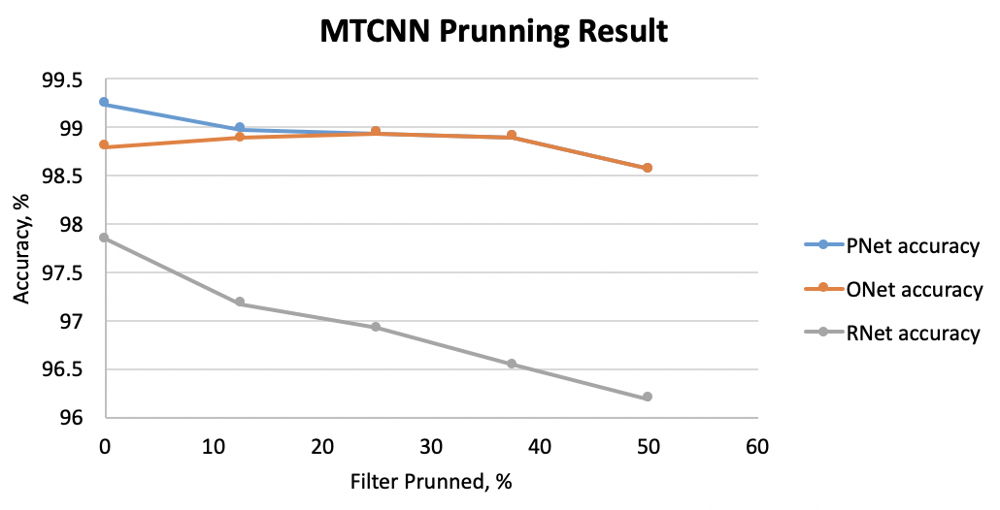
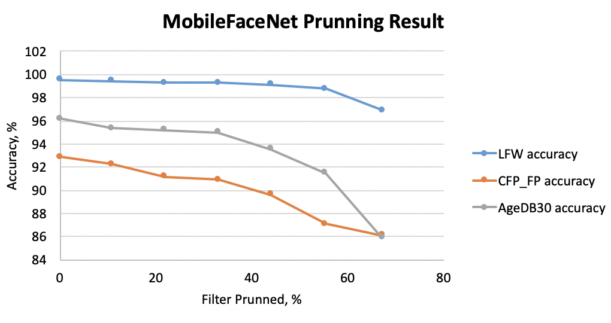

# Pruning_MTCNN_MobileFaceNet_Pytorch

This repo demonstrates how to prune MTCNN and MobileFaceNet using Pytorch implementation. 
The whole model size can be reduced by x2.5 with x1.7 speedup and negligible accuracy loss. 
The results are shown as the below table. 
The base model and pruned model are provided in this repo. 

| Mobel | Weight Size (base vs pruned) | Accuracy (base vs pruned) | Time(speed up) | 
|  :------:     | :---------: | :---------: |:---------: |
|   PNet     | 28.8KB vs  9KB    |  98.24 vs 98.9 | 1.6x |
|   RNet     | 403.5KB vs 138.6KB     |  97.85 vs 96.54 | 1.4x |
|   ONet     | 1.6MB vs 658.6KB     |  98.8 vs 98.9 | 2.1x |
|   MobileFaceNet     | 4.9MB vs 1.9MB     |  99.52 vs 99.3 (LFW) | 1.8x |

## Pruning Criteria 

The pruning criteria is based on the paper [Pruning Convolutional Neural Networks for Resource Efficient Inference](https://arxiv.org/abs/1611.06440). 
Please go through the "Pruning MTCNN Tutorial" and "Pruning MobileFaceNet Tutorial" for detailed information. 

## How to Use 

### Prepare the training dataset and put it into the "data_set" folder
1. MobileFaceNet: faces_emore, LFW, CFP-FP and AgeDB-30 from [Model Zoo](https://github.com/deepinsight/insightface/wiki/Dataset-Zoo)
2. MTCNN: [WIDER FACE](http://shuoyang1213.me/WIDERFACE/), [CNN_FacePoint](http://mmlab.ie.cuhk.edu.hk/archive/CNN_FacePoint.htm), prepare 12x12, 24x24, 48x48 images respectively, and put the annotation files into "data_preprocessing/anno_store"
. Refer to [MTCNN_Tutorial](https://github.com/xuexingyu24/MTCNN_Tutorial) for the data preparation 

### Pruning
* **MTCNN** 
* python MTCNN/Pnet_Prune.py
* python MTCNN/Onet_Prune.py
* python MTCNN/Rnet_Prune.py
*  **MobileFaceNet**
* python MFN/MFN_Prune.py 

## Reference 
* [pytorch-pruning](https://github.com/jacobgil/pytorch-pruning)

Please give me a star if it is helpful for your research
